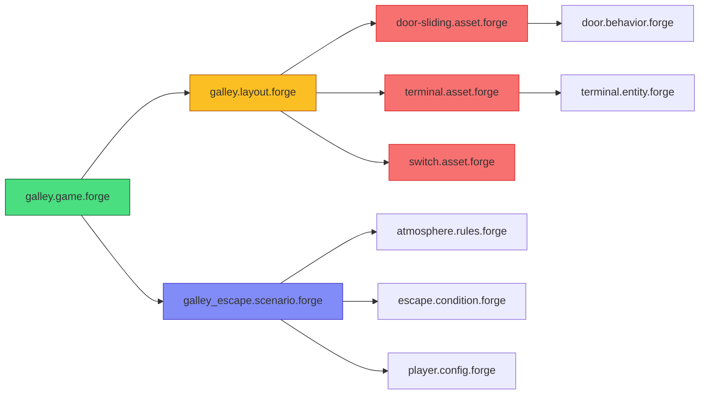
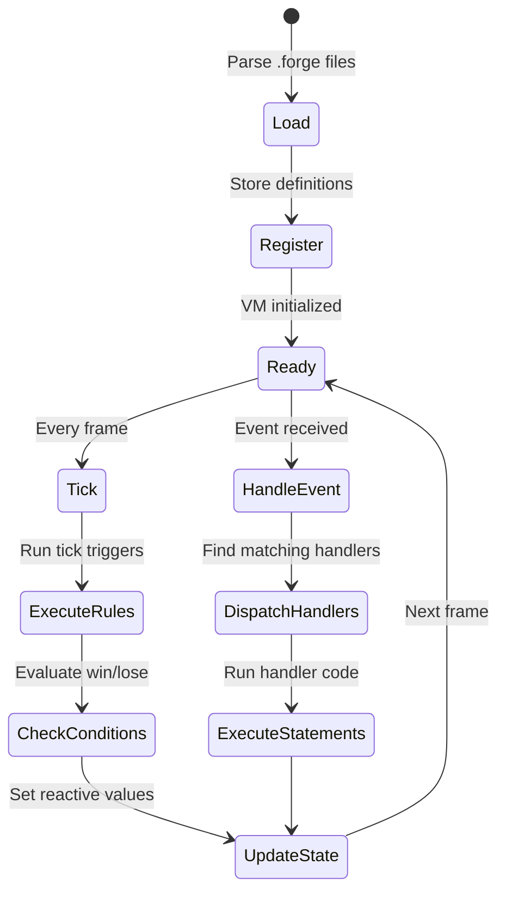
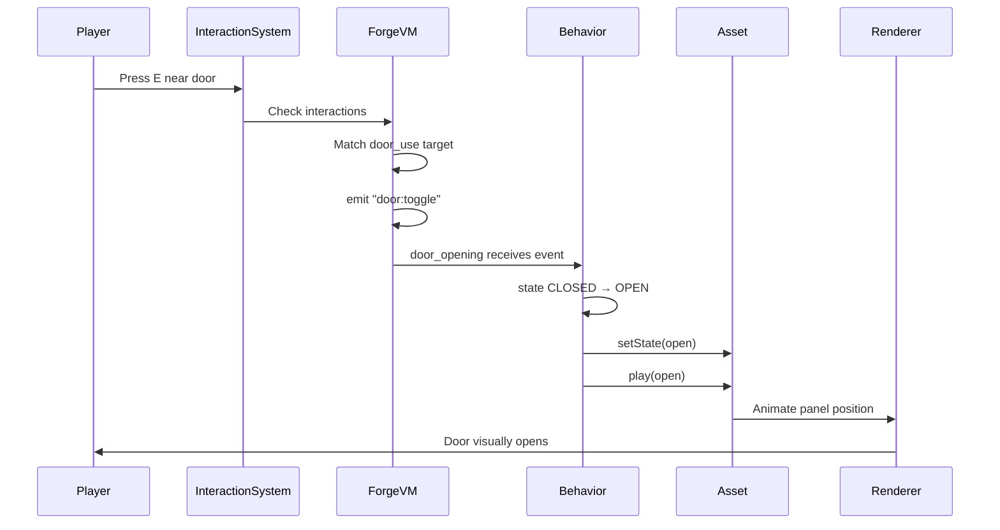

# Forge DSL Overview

Forge is the domain-specific language used to define all game content in StarLang. It handles everything from visual assets to game rules, replacing hardcoded TypeScript with declarative, data-driven definitions.

## Philosophy

Forge follows these core principles:

1. **Separation of Engine and Content**: The engine (TypeScript) provides systems; Forge defines content
2. **Declarative over Imperative**: Describe what you want, not how to achieve it
3. **Reactive State**: Use `$variable` syntax for automatic state binding
4. **Indent-Based Blocks**: Python-style indentation for clean, readable structure

## Architecture

```mermaid
graph TB
    subgraph GAME["game/ (CONTENT)"]
        FORGE[".forge files<br/>assets, configs, behaviors"]
        SL[".sl files<br/>ship system definitions"]
    end

    subgraph ENGINE["src/forge/ (FORGE ENGINE)"]
        LEXER[Lexer]
        PARSER[Parser]
        AST[AST]
        VM[ForgeVM]
        EVAL[Evaluator]
        EXEC[Executor]

        LEXER --> PARSER --> AST --> VM
        VM --> EVAL
        VM --> EXEC
    end

    subgraph RUNTIME["src/engine/ (GAME ENGINE)"]
        PLAYER[PlayerSystem]
        SCENE[SceneSystem]
        VOXEL[VoxelEngine]
        RT[Runtime]
    end

    FORGE --> LEXER
    SL --> RT
    VM --> PLAYER
    VM --> SCENE
    VM --> VOXEL
    RT --> VM

    style GAME fill:#2d4a3e,stroke:#4ade80
    style ENGINE fill:#3d3a5c,stroke:#818cf8
    style RUNTIME fill:#4a3d3d,stroke:#f87171
```



## File Types

All files use the `.forge` extension. The middle part (`.asset.`, `.config.`, etc.) is a **naming convention** for organization - the compiler doesn't care about filenames. It parses each file and extracts blocks by their type in the AST.

| Convention | Purpose | Example |
|------------|---------|---------|
| `.asset.forge` | Visual assets (voxel models, animations) | `door-sliding.asset.forge` |
| `.config.forge` | Game configuration values | `player.config.forge` |
| `.entity.forge` | Interactive entities with screens | `terminal.entity.forge` |
| `.layout.forge` | Room and object placement | `galley.layout.forge` |
| `.scenario.forge` | Gameplay scenarios with win conditions | `galley_escape.scenario.forge` |
| `.rules.forge` | Tick-based simulation rules | `atmosphere.rules.forge` |
| `.behavior.forge` | Reusable entity behaviors | `door.behavior.forge` |
| `.condition.forge` | Victory/defeat conditions | `galley_escape.condition.forge` |
| `.game.forge` | Game definition entry point | `galley.game.forge` |

::: tip
A single `.forge` file can contain multiple block types. For example, you could define an asset and its behavior in the same file.
:::

## File Dependencies



## Top-Level Blocks

Forge supports these top-level definition types:

```forge
# Visual assets with geometry and animation
asset door-sliding
  ...

# Game configuration values
config player
  ...

# Interactive entities with screens
entity terminal
  ...

# Room layouts and object placement
layout galley-deck
  ...

# Gameplay scenarios
scenario galley_escape
  ...

# Tick-based simulation rules
rule o2_depletion
  ...

# Reusable behaviors
behavior door_opening
  ...

# Victory/defeat conditions
condition escape_galley
  ...

# Game definition entry point
game galley_escape
  ...

# Player interaction definitions
interaction switch_use
  ...

# Helper functions
def clamp(value, min, max)
  ...
```

## Basic Syntax

### Comments
```forge
# This is a comment
```

### Values
```forge
# Numbers
42
3.14
-0.5

# Hex numbers
0xFF
0x1a2b3c

# Strings
"Hello World"
"Line with\nnewline"

# Booleans
true
false

# Colors
#ff0000      # Red (6 hex digits)
#f00         # Red (3 hex digits)
#ff0000ff    # Red with alpha (8 hex digits)

# Durations
300ms        # Milliseconds
2s           # Seconds
1.5m         # Minutes
1h           # Hours

# Vectors
(10, 20)         # Vec2
(10, 20, 30)     # Vec3

# Lists
[1, 2, 3]
["a", "b", "c"]

# Ranges
0..10
1..100
```

### Reactive References

Use `$` to reference reactive state values:

```forge
$player_room           # Current player room
$player_room_o2        # O2 level in player's room
$door.state            # Entity's state property
$delta                 # Time since last tick
```

### Expressions

```forge
# Arithmetic
$value + 10
$health - damage
$speed * 2
$total / count

# Comparison
$o2_level < 15
$state == "OPEN"
$count >= 5

# Logical
$powered and $enabled
$damage or $fault
not $active

# Membership
$type in ["SWITCH", "BUTTON"]
```

### Indentation

Forge uses indentation to define blocks (2 spaces recommended):

```forge
asset my-asset
  params:
    enabled: bool = true

  geometry:
    box (0, 0, 0) to (10, 10, 10) as METAL

  when $enabled:
    # This block executes when enabled changes
    emit "asset:enabled"
```

## The ForgeVM

The ForgeVM is the runtime that executes Forge scripts:



### VM Lifecycle

1. **Load**: Parse `.forge` files into AST
2. **Register**: Store rules, scenarios, behaviors, configs
3. **Tick**: Execute tick-triggered rules every frame
4. **Events**: Dispatch events to handlers
5. **State**: Manage reactive state values

```typescript
// Engine integration
const vm = new ForgeVM()
vm.loadSource(forgeCode)
vm.startScenario('galley_escape')

// Game loop
function update(delta: number) {
  vm.tick(delta)  // Execute rules, check conditions
}

// Event handling
vm.emit('door:open', { doorId: 'galley_exit' })
vm.on('game:victory', () => showVictoryScreen())
```

## Complete Example: Interactive Door

This example shows how different Forge files work together:

### 1. Asset Definition (`door-sliding.asset.forge`)

```forge
# Define the visual appearance and states
asset door-sliding
  params:
    width: int = 48
    height: int = 86

  parts:
    panel:
      box (0, 0, 0) size ($width, $height, 10) as DOOR_PANEL

  states:
    open:
      panel.position: (0, $height + 1, 0)
    closed:
      panel.position: (0, 1, 0)

  animations:
    open:
      animate panel.position from closed to open over 300ms using easeOutQuad
    close:
      animate panel.position from open to closed over 300ms using easeInQuad
```

### 2. Behavior (`door.behavior.forge`)

```forge
# Define how the door responds to events
behavior door_opening
  initial:
    state: CLOSED

  on door:toggle:
    match $state:
      CLOSED:
        set state: OPEN
        setState(open)
        play(open)
      OPEN:
        set state: CLOSED
        setState(closed)
        play(close)
```

### 3. Interaction (`interactions.forge`)

```forge
# Define player interaction
interaction door_use
  target: entity where voxel_type == DOOR_FRAME
  range: 2.0
  prompt: "Press [E] to {$state == CLOSED ? 'open' : 'close'}"

  on_interact:
    emit "door:toggle" at $target
```

### 4. Layout Placement (`galley.layout.forge`)

```forge
# Place the door in the world
layout galley-deck
  doors:
    galley_exit at (104, 0, 40) facing east
      using door-sliding
      name: "Galley Exit"
```

### How It All Connects



## Next Steps

- [Syntax Reference](./02-syntax.md) - Complete syntax documentation
- [Assets](./03-assets.md) - Creating visual assets
- [Config](./04-config.md) - Game configuration
- [Scripting](./05-scripting.md) - Rules, scenarios, behaviors
- [Layouts](./06-layouts.md) - Room and entity placement
