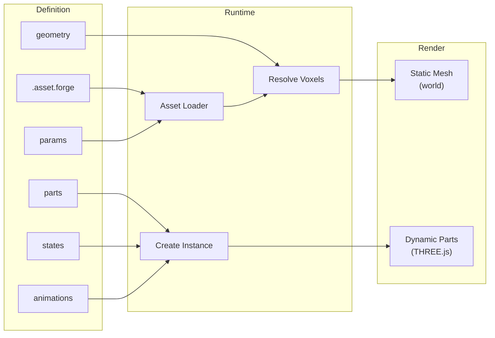
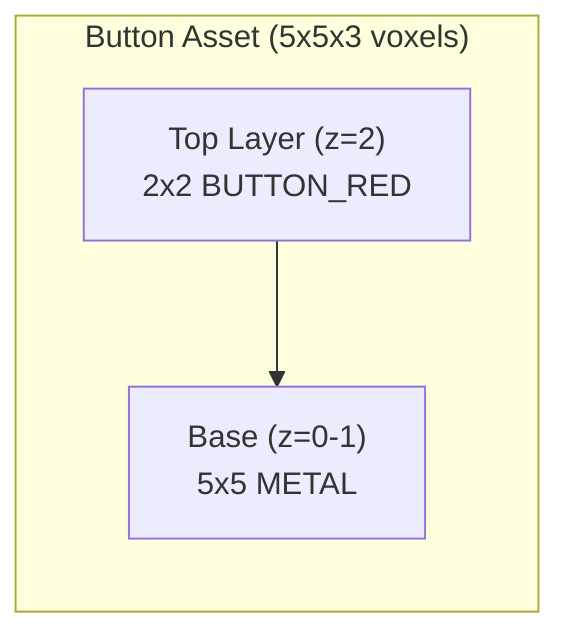
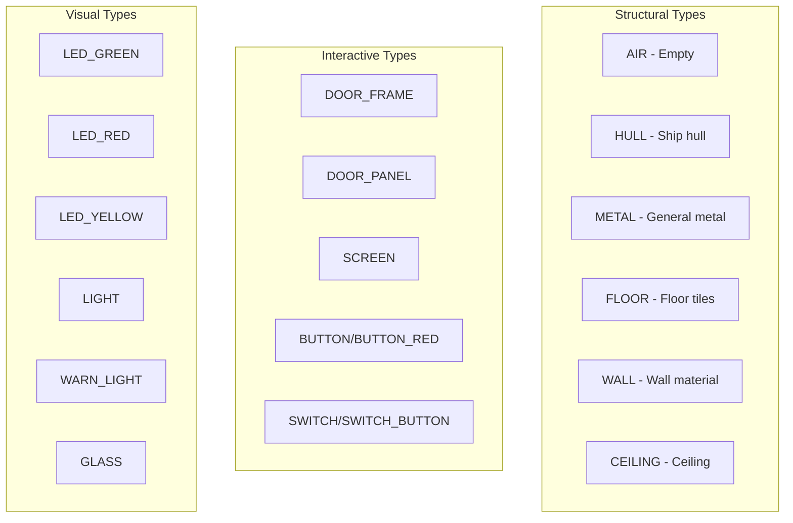
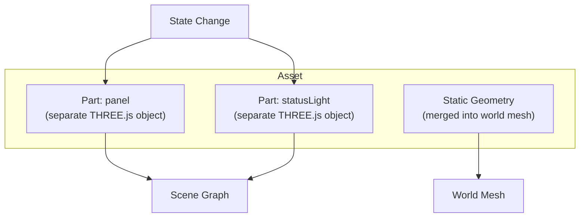
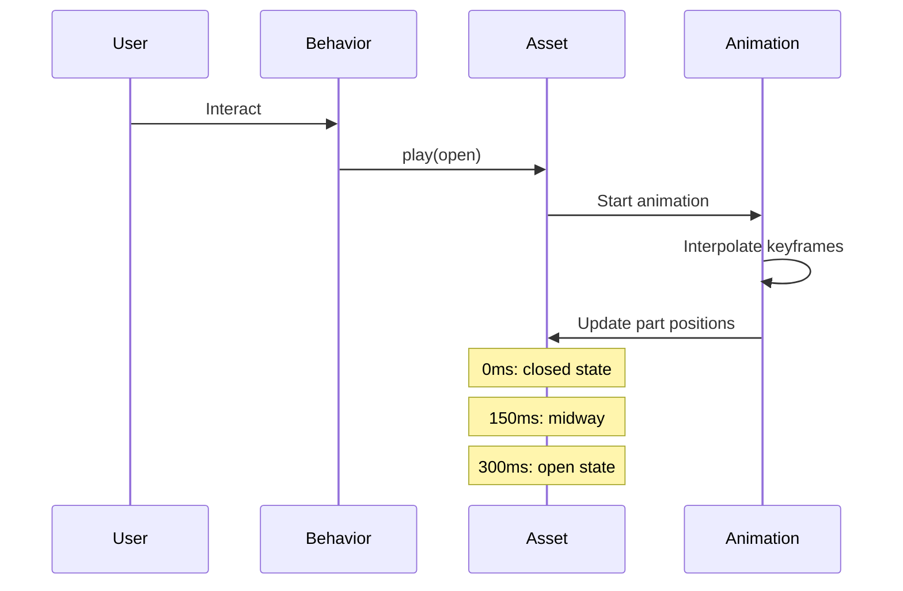
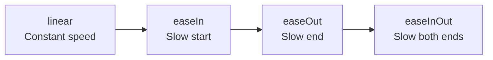

# Forge Assets

Assets define visual objects using voxel geometry, with support for states and animations.

## Asset Pipeline



## Asset Structure

```forge
asset asset-name
  name: "Display Name"
  description: "Optional description"
  anchor: (x, y, z)       # Origin point for placement

  params:
    # Configurable parameters

  geometry:
    # Static voxel geometry

  parts:
    # Named movable parts

  children:
    # Child assets (nested models)

  states:
    # Visual state definitions

  animations:
    # Animation timelines

  when/on:
    # Reactive behavior
```

## Working Example: Simple Button

Let's build a simple button from scratch:

```forge
asset button
  name: "Button"
  anchor: (2, 2, 0)  # Center point for placement

  geometry:
    # Base plate (5x5x2 voxels)
    box (0, 0, 0) to (4, 4, 2) as METAL

    # Button surface (2x2 centered on top)
    (1, 1, 2) as BUTTON_RED
    (2, 1, 2) as BUTTON_RED
    (1, 2, 2) as BUTTON_RED
    (2, 2, 2) as BUTTON_RED
```

This creates:



## Parameters

Define configurable parameters that can be set when placing assets:

```forge
params:
  # Basic types with defaults
  enabled: bool = true
  count: int = 5
  speed: float = 2.5
  name: string = "Default"

  # Constrained ranges
  brightness: float[0..1] = 1.0
  health: float[0..100] = 100

  # Enumerations
  state: enum(OPEN, CLOSED, LOCKED) = CLOSED

  # Optional parameters (no default)
  target: ref(room)
```

### Using Parameters in Geometry

```forge
asset scalable-panel
  params:
    width: int = 10
    height: int = 20

  geometry:
    box (0, 0, 0) size ($width, $height, 2) as METAL
```

## Geometry Primitives

### Single Voxel

```forge
geometry:
  (x, y, z) as VOXEL_TYPE
  (0, 0, 0) as METAL
  (1, 0, 0) as HULL
  (2, 0, 0) as SCREEN  # Comment
```

### Box

Fill a rectangular region:

```forge
geometry:
  # From corner to corner (inclusive)
  box (0, 0, 0) to (10, 5, 10) as METAL

  # From corner with size
  box (0, 0, 0) size (10, 5, 10) as HULL
```

### Repeat Pattern

Generate repeated geometry:

```forge
geometry:
  # Repeat along one axis
  repeat x from 0 to 10 step 2:
    (x, 0, 0) as LED_GREEN

  # Repeat along multiple axes
  repeat x from 0 to 8 step 2:
    repeat z from 0 to 8 step 2:
      (x, 0, z) as FLOOR_TILE

  # With expressions
  repeat i from 0 to 5:
    (i * 4, i, 0) as METAL
```

## Working Example: LED Strip

Create a row of LEDs with repeat:

```forge
asset led-strip
  params:
    length: int = 10
    color: enum(GREEN, RED, YELLOW) = GREEN

  geometry:
    # Base strip
    box (0, 0, 0) size ($length * 3, 2, 2) as METAL

    # LED bulbs every 3 voxels
    repeat i from 0 to $length - 1:
      match $color:
        GREEN: (i * 3 + 1, 1, 2) as LED_GREEN
        RED: (i * 3 + 1, 1, 2) as LED_RED
        YELLOW: (i * 3 + 1, 1, 2) as LED_YELLOW
```

## Voxel Types

Standard voxel types used in the engine:



| Type | Description |
|------|-------------|
| `AIR` | Empty space (default) |
| `HULL` | Ship hull material |
| `METAL` | General metal surfaces |
| `FLOOR` | Floor tiles |
| `CEILING` | Ceiling tiles |
| `WALL` | Wall material |
| `DOOR_FRAME` | Door frame |
| `DOOR_PANEL` | Door panel (slides) |
| `SCREEN` | Terminal screens |
| `LED_GREEN` | Green LED |
| `LED_RED` | Red LED |
| `LED_YELLOW` | Yellow LED |
| `BUTTON` | Button surface |
| `BUTTON_RED` | Red button |
| `SWITCH` | Switch surface |
| `SWITCH_BUTTON` | Switch button |
| `DUCT` | Ventilation duct |
| `GLASS` | Transparent glass |
| `VENT` | Vent grating |
| `LIGHT` | Light fixture |
| `WARN_LIGHT` | Warning light |

## Parts (Dynamic Geometry)

Parts are named geometry groups that can be animated independently:



```forge
asset door-sliding
  parts:
    panel:
      box (0, 0, 0) size (48, 86, 10) as DOOR_PANEL
      at: (0, 1, 0)   # Initial position

    statusLight:
      repeat x from -20 to 16 step 4:
        (x, 0, 0) as LED_GREEN
      at: (0, 90, 0)
```

### Animatable Properties

Parts have these animatable properties:

| Property | Type | Description |
|----------|------|-------------|
| `position` | Vec3 | Position offset |
| `rotation` | Vec3 | Rotation angles (degrees) |
| `scale` | Vec3 | Scale factors |
| `emissive` | Color @ intensity | Glow color and brightness |
| `visible` | bool | Visibility toggle |

## Child Assets

Include other assets as children:

```forge
asset wall-fan
  geometry:
    # Static duct housing
    box (0, 0, 0) to (16, 16, 8) as DUCT

  # Include animated fan blades as child
  child fan-blades at (8, 8, 3):
    when $powered:
      animate spin on z at $speed
```

Child blocks can contain reactive behavior:

```forge
child status-led at (0, 10, 0):
  when $status:
    match $status:
      OK -> setState(green)
      FAULT -> setState(red)
      WARNING -> setState(yellow)
```

## States

Define visual states for parts:

```forge
states:
  closed:
    panel.position: (0, 1, 0)
    statusLight.emissive: #888888 @ 0.5

  open:
    panel.position: (0, 87, 0)
    statusLight.emissive: #77dd77 @ 0.8

  locked:
    panel.position: (0, 1, 0)
    statusLight.emissive: #ffb347 @ 0.8

  sealed:
    panel.position: (0, 1, 0)
    statusLight.emissive: #ff6b6b @ 1.0
```

### Emissive Intensity

Use `@` for intensity (0.0 to 1.0):

```forge
emissive: #ff0000 @ 0.5   # Red at 50% intensity
emissive: #00ff00 @ 1.0   # Green at full intensity
emissive: #ffffff @ 0.0   # Off
```

## Animations

Define keyframe animations between states:



```forge
animations:
  open: 300ms
    0% -> closed
    100% -> open using easeOutQuad

  close: 300ms
    0% -> open
    100% -> closed using easeInQuad

  flash: 500ms loop
    0% -> off
    50% -> on
    100% -> off
```

### Animation Options

| Option | Example | Description |
|--------|---------|-------------|
| Duration | `300ms`, `1s`, `0.5s` | Animation length |
| Easing | `easeOutQuad` | Interpolation curve |
| Loop | `loop` keyword | Repeat continuously |

### Easing Functions



Available easing functions:
- `linear` - Constant speed
- `easeIn`, `easeInQuad`, `easeInCubic` - Accelerate
- `easeOut`, `easeOutQuad`, `easeOutCubic` - Decelerate
- `easeInOut`, `easeInOutQuad`, `easeInOutCubic` - Both

## Reactive Behavior

### When Blocks (Value Changes)

Use `when` blocks for reactive updates:

```forge
when $state:
  match $state:
    OPEN -> setState(open), play(open)
    CLOSED -> setState(closed), play(close)
    LOCKED -> setState(locked), play(close)
    SEALED -> setState(sealed), play(close)

when $powered:
  if $powered:
    animate spin on z at $speed
  else:
    stopAnimation(spin)
```

### On Blocks (Events)

Use `on` blocks for event handling:

```forge
on interact:
  if $state == "CLOSED":
    emit "door:open"
  else:
    emit "door:close"

on damage:
  setState(damaged)
  emit "sparks"
```

## Complete Example: Animated Door

```forge
# Vertical sliding door with status indicator
asset door-sliding
  name: "Sliding Door"
  anchor: (0, 0, 0)

  params:
    state: enum(OPEN, CLOSED, LOCKED, SEALED) = CLOSED

  # Static door frame
  geometry:
    # Left pillar
    box (0, 0, 0) size (4, 96, 12) as DOOR_FRAME
    # Right pillar
    box (44, 0, 0) size (4, 96, 12) as DOOR_FRAME
    # Top beam
    box (4, 88, 0) size (40, 8, 12) as DOOR_FRAME

  # Dynamic parts
  parts:
    panel:
      box (0, 0, 0) size (48, 86, 10) as DOOR_PANEL
      at: (0, 1, 0)

    statusLight:
      repeat x from 8 to 36 step 4:
        (x, 0, 0) as LED_GREEN
      at: (0, 90, 6)

  # Visual states
  states:
    closed:
      panel.position: (0, 1, 0)
      statusLight.emissive: #888888 @ 0.5

    open:
      panel.position: (0, 87, 0)
      statusLight.emissive: #77dd77 @ 0.8

    locked:
      panel.position: (0, 1, 0)
      statusLight.emissive: #ffb347 @ 0.8

    sealed:
      panel.position: (0, 1, 0)
      statusLight.emissive: #ff6b6b @ 1.0

  # Animations
  animations:
    open: 300ms
      0% -> closed
      100% -> open using easeOutQuad

    close: 300ms
      0% -> open
      100% -> closed using easeInQuad

  # Reactive behavior
  when $state:
    match $state:
      OPEN -> setState(open), play(open)
      CLOSED -> setState(closed), play(close)
      LOCKED -> setState(locked), play(close)
      SEALED -> setState(sealed), play(close)
```

## Complete Example: Spinning Fan

```forge
asset wall-fan
  name: "Ventilation Fan"
  anchor: (8, 8, 0)

  params:
    powered: bool = true
    speed: float = 4.0
    status: enum(OK, FAULT, STANDBY) = OK

  # Static housing
  geometry:
    # Duct frame
    box (0, 0, 0) size (16, 16, 4) as DUCT
    # Vent grill
    repeat y from 2 to 14 step 2:
      box (2, y, 4) size (12, 1, 1) as VENT

  parts:
    blades:
      # Four fan blades
      box (-1, -6, 0) size (2, 12, 1) as METAL
      box (-6, -1, 0) size (12, 2, 1) as METAL
      at: (8, 8, 2)  # Center of fan

    statusLed:
      (0, 0, 0) as LED_GREEN
      at: (14, 14, 5)

  states:
    running:
      statusLed.emissive: #77dd77 @ 0.8

    stopped:
      statusLed.emissive: #888888 @ 0.3

    fault:
      statusLed.emissive: #ff6b6b @ 1.0

  animations:
    spin: loop
      0% -> blades.rotation: (0, 0, 0)
      100% -> blades.rotation: (0, 0, 360) using linear

    flash: 500ms loop
      0% -> statusLed.emissive: #ff6b6b @ 0.0
      50% -> statusLed.emissive: #ff6b6b @ 1.0
      100% -> statusLed.emissive: #ff6b6b @ 0.0

  when $powered and $status == OK:
    setState(running)
    animate blades spin at $speed

  when not $powered or $status != OK:
    stopAnimation(spin)
    if $status == FAULT:
      setState(fault)
      play(flash)
    else:
      setState(stopped)
```

## Complete Example: Terminal Screen

```forge
asset terminal
  name: "Status Terminal"
  anchor: (0, 0, 0)

  params:
    terminal_type: enum(STATUS, ENGINEERING, COMMAND) = STATUS
    powered: bool = true

  geometry:
    # Frame
    box (0, 0, 0) size (32, 40, 4) as TERMINAL_FRAME

    # Screen area
    box (2, 2, 4) size (28, 32, 1) as SCREEN

    # Keyboard
    box (2, 36, 4) size (28, 4, 2) as METAL

  parts:
    screenGlow:
      box (2, 2, 5) size (28, 32, 1) as AIR
      at: (0, 0, 0)

    statusLed:
      (30, 38, 5) as LED_GREEN
      at: (0, 0, 0)

  states:
    on:
      screenGlow.emissive: #1a2744 @ 0.6
      statusLed.emissive: #77dd77 @ 0.8

    off:
      screenGlow.emissive: #000000 @ 0.0
      statusLed.emissive: #333333 @ 0.2

  animations:
    bootup: 1s
      0% -> off
      20% -> screenGlow.emissive: #1a2744 @ 0.1
      40% -> screenGlow.emissive: #1a2744 @ 0.3
      60% -> screenGlow.emissive: #1a2744 @ 0.5
      100% -> on using easeOut

    shutdown: 300ms
      0% -> on
      100% -> off using easeIn

  when $powered:
    if $powered:
      play(bootup)
    else:
      play(shutdown)
```
