# Voxel System

StarLang uses a voxel-based rendering system for all 3D geometry. This provides a consistent retro-futuristic aesthetic and enables data-driven asset creation.

## Overview

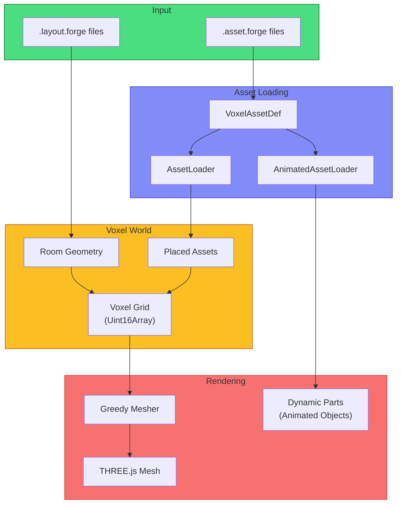

## Voxel Pipeline

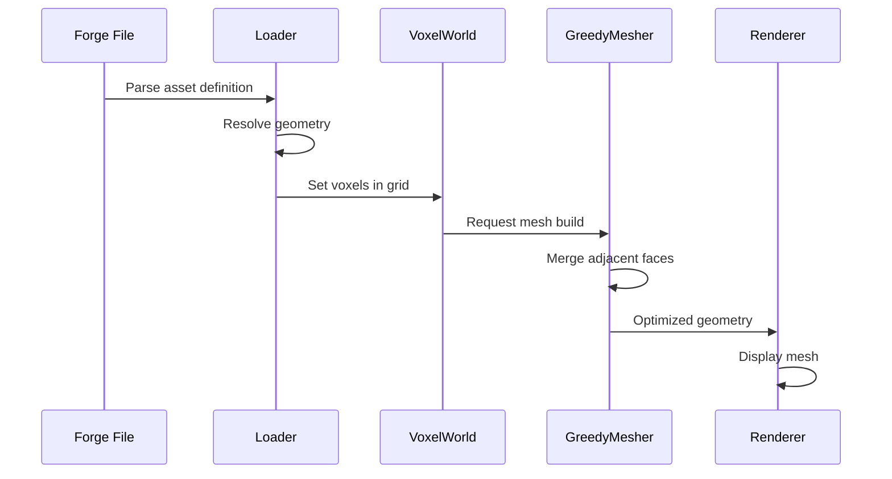

## Voxel Types

Voxels are defined by type, which determines their appearance:

```mermaid
graph LR
    subgraph STRUCTURAL["Structural"]
        HULL[HULL]
        METAL[METAL]
        FLOOR[FLOOR]
        WALL[WALL]
        CEILING[CEILING]
    end

    subgraph FUNCTIONAL["Functional"]
        DOOR_FRAME[DOOR_FRAME]
        DOOR_PANEL[DOOR_PANEL]
        SCREEN[SCREEN]
        BUTTON[BUTTON]
        SWITCH[SWITCH]
    end

    subgraph VISUAL["Visual"]
        LED_GREEN[LED_GREEN]
        LED_RED[LED_RED]
        LED_YELLOW[LED_YELLOW]
        LIGHT[LIGHT]
        GLASS[GLASS]
    end

    style STRUCTURAL fill:#4a4a55,stroke:#2a2a35
    style FUNCTIONAL fill:#3d5a80,stroke:#293241
    style VISUAL fill:#4ade80,stroke:#166534
```

```forge
# From voxel-types.config.forge
config voxelTypes
  AIR: 0          # Empty space
  HULL: 1         # Ship hull
  METAL: 2        # General metal
  FLOOR: 3        # Floor tiles
  WALL: 4         # Wall material
  CEILING: 5      # Ceiling tiles
  DOOR_FRAME: 6   # Door frame
  DOOR_PANEL: 7   # Movable door
  SCREEN: 8       # Terminal screen
  LED_GREEN: 9    # Green LED
  LED_RED: 10     # Red LED
  LED_YELLOW: 11  # Yellow LED
  BUTTON: 12      # Button surface
  SWITCH: 13      # Switch surface
  DUCT: 14        # Ventilation
  GLASS: 15       # Transparent
  VENT: 16        # Vent grating
  LIGHT: 17       # Light fixture
```

## Voxel Colors

Each type maps to a color:

```forge
# From voxel-colors.config.forge
config voxelColors
  HULL: #2a2a35
  METAL: #4a4a55
  FLOOR: #3a3a45
  WALL: #353540
  SCREEN: #1a2744
  LED_GREEN: #77dd77
  LED_RED: #ff6b6b
  GLASS: #aaccff
```

## Coordinate System

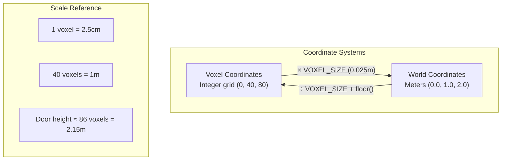

- **Voxel coordinates**: Integer grid positions
- **World coordinates**: Floating-point meters
- **VOXEL_SIZE**: 0.025m (2.5cm per voxel)

```typescript
// Conversion functions
function voxelToWorld(vx: number, vy: number, vz: number): THREE.Vector3 {
  return new THREE.Vector3(
    vx * VOXEL_SIZE,
    vy * VOXEL_SIZE,
    vz * VOXEL_SIZE
  )
}

function worldToVoxel(x: number, y: number, z: number): { x: number, y: number, z: number } {
  return {
    x: Math.floor(x / VOXEL_SIZE),
    y: Math.floor(y / VOXEL_SIZE),
    z: Math.floor(z / VOXEL_SIZE)
  }
}
```

## VoxelAssetLoader

Loads and resolves assets from Forge definitions:

```typescript
import { assetLoader, loadBuiltinAssetsAsync } from './VoxelAssetLoader'

// Load all assets at startup
await loadBuiltinAssetsAsync()

// Get asset definition
const door = assetLoader.getAsset('door-sliding')

// Resolve to voxels at position
const voxels = assetLoader.resolve(
  'door-sliding',           // Asset ID
  { x: 100, y: 0, z: 50 },  // Position
  90,                       // Rotation (0, 90, 180, 270)
  { state: 'OPEN' },        // Parameters
  0                         // Height offset
)
```

## AnimatedAssetLoader

Handles assets with dynamic parts:

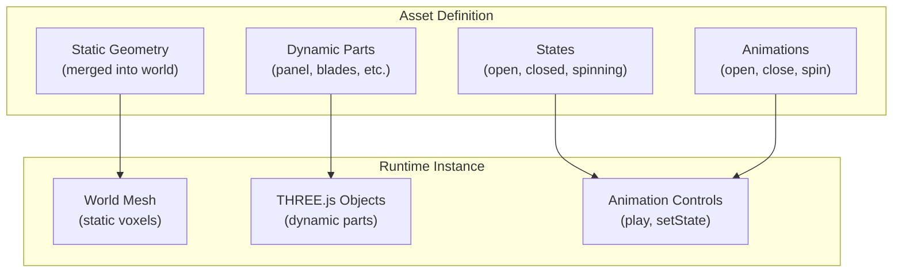

```typescript
import { animatedAssetLoader, loadAnimatedAssetsAsync } from './AnimatedAssetLoader'

// Load animated assets
await loadAnimatedAssetsAsync()

// Create runtime instance
const instance = animatedAssetLoader.createInstance(
  'wall-fan',
  { x: 80, y: 50, z: 120 },
  180,  // rotation
  { powered: true, speed: 4.0 }
)

// Instance provides:
// - Static voxels (for world mesh)
// - Dynamic parts (THREE.js objects)
// - Animation controls
```

## VoxelWorld

Manages the voxel grid and mesh generation:

```typescript
class VoxelWorld {
  // Dimensions
  private width: number
  private height: number
  private depth: number
  private voxels: Uint16Array

  // Set a voxel
  setVoxel(x: number, y: number, z: number, type: number): void

  // Get a voxel
  getVoxel(x: number, y: number, z: number): number

  // Build mesh from voxels
  buildMesh(): THREE.Mesh

  // Check collision at world position
  isColliding(worldPos: THREE.Vector3, radius: number): boolean
}
```

## GreedyMesher

Optimizes voxel rendering by merging adjacent faces:

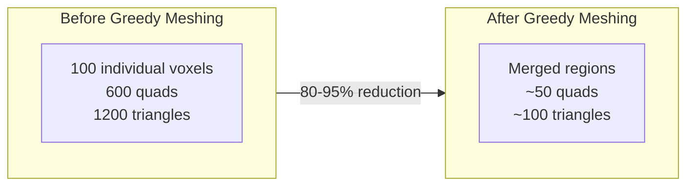

```typescript
class GreedyMesher {
  // Generate optimized mesh from voxel data
  mesh(
    voxels: Uint16Array,
    width: number,
    height: number,
    depth: number
  ): {
    positions: Float32Array
    normals: Float32Array
    colors: Float32Array
    indices: Uint32Array
  }
}
```

The greedy mesher algorithm:

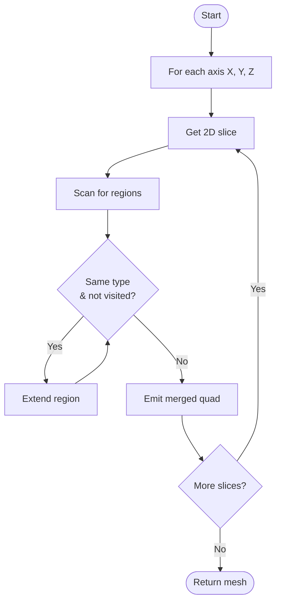

## Room Building

Rooms are built from layout definitions:

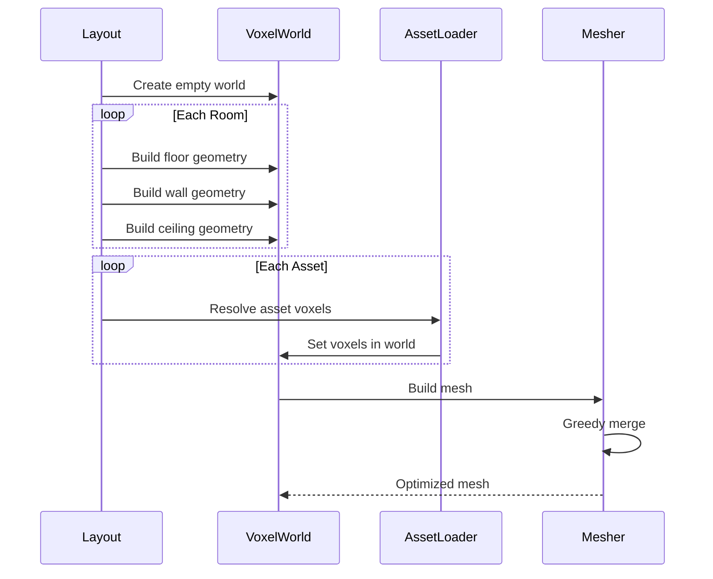

```typescript
// Build voxel world from layout
const world = new VoxelWorld(width, height, depth)

// Add room geometry (floor, walls, ceiling)
for (const room of layout.rooms) {
  buildRoomGeometry(world, room)
}

// Add placed assets
for (const asset of layout.assets) {
  const voxels = assetLoader.resolve(asset.asset, asset.position, asset.rotation)
  for (const voxel of voxels) {
    world.setVoxel(voxel.x, voxel.y, voxel.z, voxel.type)
  }
}

// Generate mesh
const mesh = world.buildMesh()
scene.add(mesh)
```

## Animated Parts

Assets with `parts` blocks create runtime THREE.js objects:

```forge
asset door-sliding
  parts:
    panel:
      box (0, 0, 0) size (48, 86, 10) as DOOR_PANEL
      at: (0, 1, 0)

  states:
    open:
      panel.position: (0, 87, 0)
    closed:
      panel.position: (0, 1, 0)
```

At runtime:

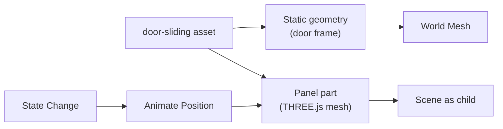

1. Static geometry goes into world mesh
2. `panel` becomes separate THREE.js mesh
3. State changes animate panel position

## Asset Resolution

When resolving assets:

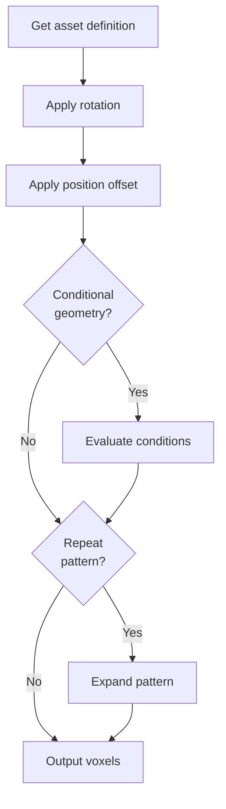

```typescript
interface ResolvedVoxel {
  x: number
  y: number
  z: number
  type: number
}

// Resolution process:
// 1. Get asset definition
// 2. Apply rotation transformation
// 3. Apply position offset
// 4. Evaluate conditional geometry
// 5. Expand repeat patterns
// 6. Return flat array of voxels
```

## Collision

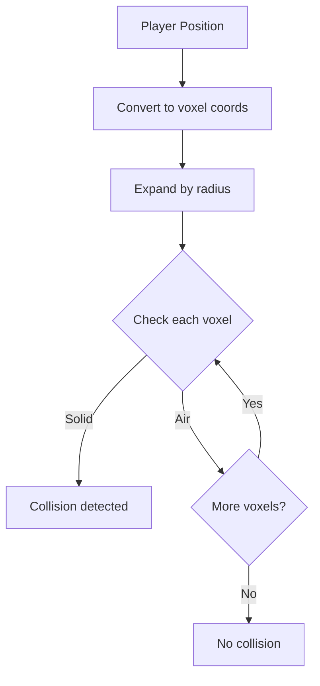

Voxel world provides collision detection:

```typescript
// Check if position collides with solid voxels
const collides = voxelWorld.isColliding(position, playerRadius)

// Get collision heights at position
const heights = voxelWorld.getCollisionHeights(x, z, radius)

// Find floor height at position
const floorY = voxelWorld.getFloorHeight(x, z)
```

## Performance

| Technique | Benefit |
|-----------|---------|
| **Pre-built meshes** | Layouts can be pre-compiled to mesh data |
| **Greedy meshing** | Reduces triangle count by 80-95% |
| **Instancing** | Repeated assets share geometry |
| **Frustum culling** | THREE.js automatic culling |
| **Uint16Array** | Efficient voxel storage (65k types) |

## File Organization

```
src/voxel/
├── VoxelTypes.ts           # Type definitions and constants
├── VoxelWorld.ts           # World grid management
├── GreedyMesher.ts         # Mesh optimization
├── VoxelAsset.ts           # Asset type definitions
├── VoxelAssetLoader.ts     # Static asset loading
├── AnimatedAsset.ts        # Animated asset types
├── AnimatedAssetLoader.ts  # Animated asset loading
└── AnimatedAssetInstance.ts # Runtime instances
```
