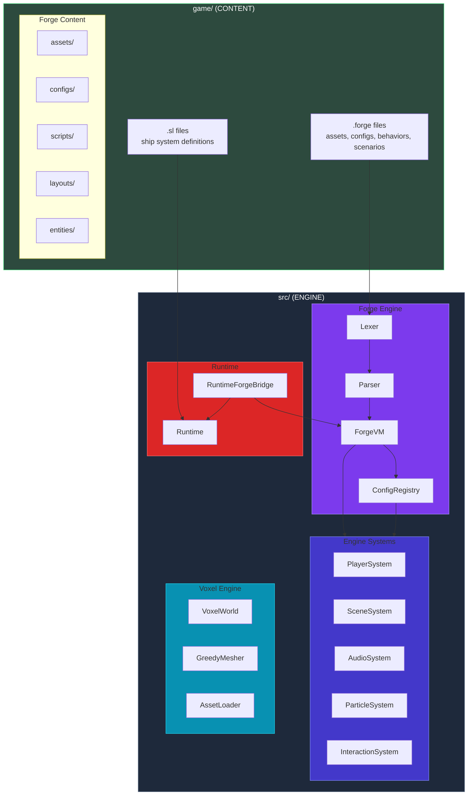
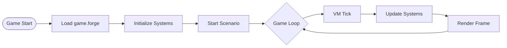
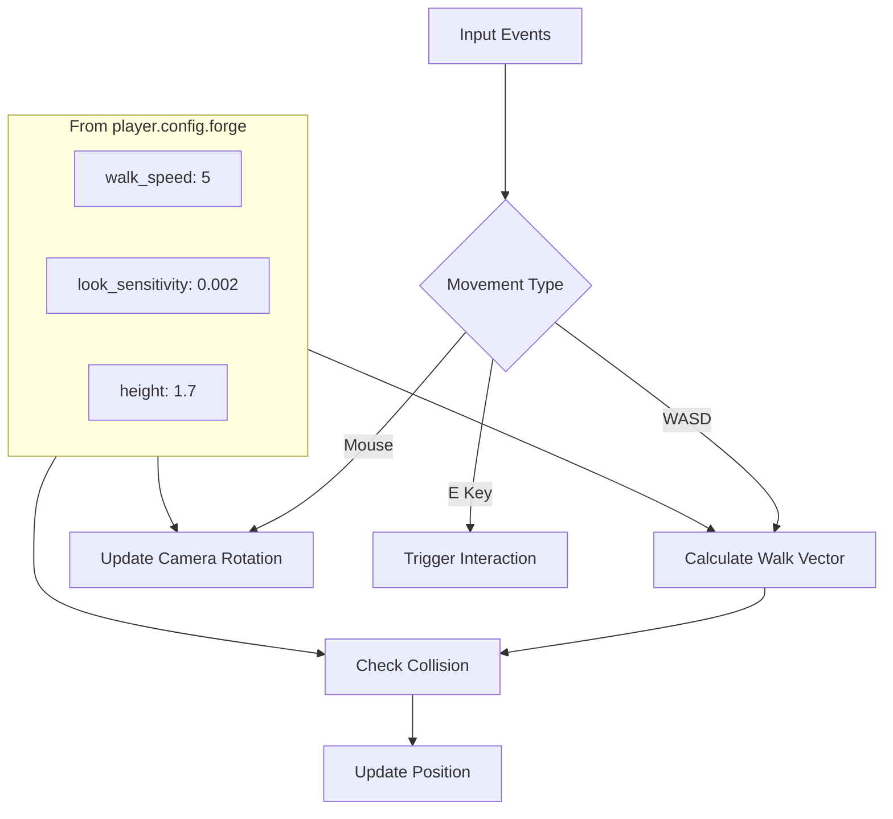
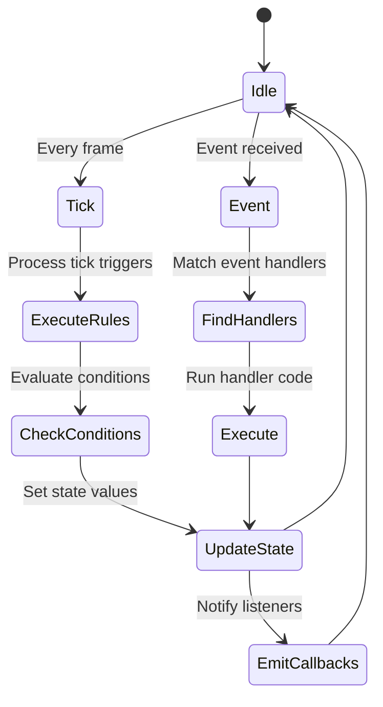
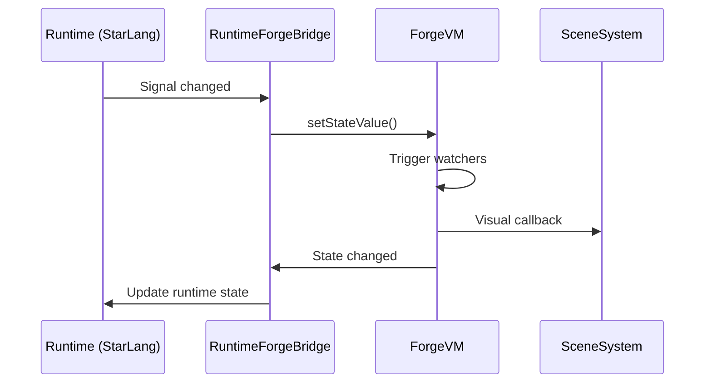
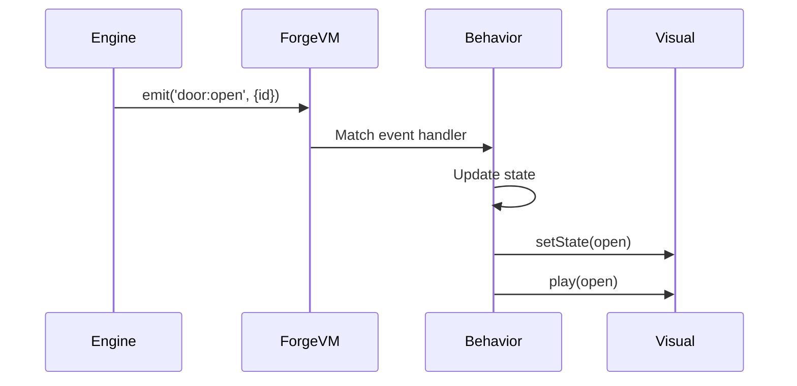
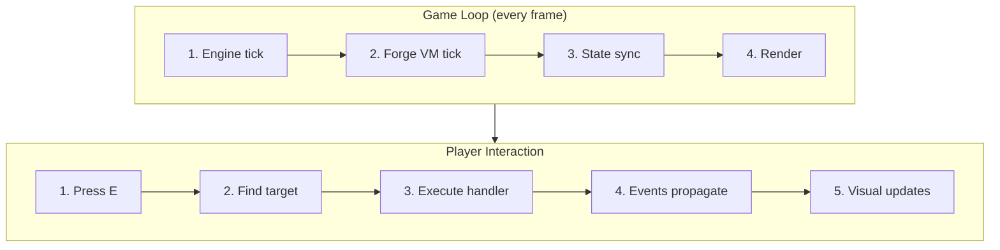
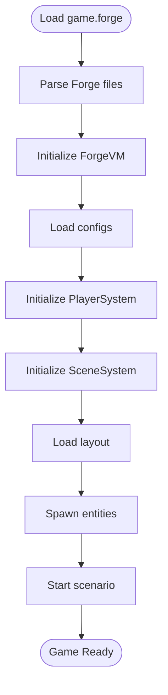
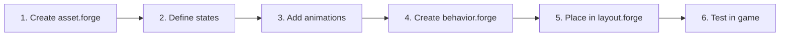

# Engine / Game Separation

StarLang follows a strict separation between the generic engine (`src/`) and game-specific content (`game/`).

## Architecture Overview



## Folder Structure

```
StarLang/
├── src/                        # ENGINE (TypeScript)
│   ├── engine/                 # Core game systems
│   │   ├── Game.ts             # Main game orchestrator
│   │   ├── PlayerSystem.ts     # First-person controller
│   │   ├── ShipScene.ts        # 3D scene management
│   │   ├── Interaction.ts      # Player interactions
│   │   ├── EntitySystem.ts     # Entity management
│   │   └── AudioSystem.ts      # Sound playback
│   │
│   ├── forge/                  # Forge DSL engine
│   │   ├── lexer.ts            # Tokenizer
│   │   ├── parser.ts           # AST builder
│   │   ├── vm.ts               # Virtual machine
│   │   ├── evaluator.ts        # Expression evaluation
│   │   ├── executor.ts         # Statement execution
│   │   └── ConfigRegistry.ts   # Config access
│   │
│   ├── voxel/                  # Voxel rendering
│   │   ├── VoxelWorld.ts       # World management
│   │   ├── GreedyMesher.ts     # Mesh optimization
│   │   └── VoxelAssetLoader.ts # Asset loading
│   │
│   ├── runtime/                # State management
│   │   ├── Runtime.ts          # StarLang runtime
│   │   └── RuntimeForgeBridge.ts # Forge integration
│   │
│   └── compiler/               # StarLang compiler
│       └── parser.ts           # .sl file parsing
│
├── game/                       # GAME CONTENT (Forge + StarLang)
│   ├── galley.game.forge       # Main game definition
│   │
│   ├── forge/                  # Forge definitions
│   │   ├── assets/             # Visual assets (.asset.forge)
│   │   ├── configs/            # Configuration (.config.forge)
│   │   ├── entities/           # Entity types (.entity.forge)
│   │   ├── layouts/            # Room layouts (.layout.forge)
│   │   └── scripts/            # Behaviors, scenarios, rules
│   │
│   └── ships/                  # Ship definitions
│       └── galley/
│           └── galley.sl       # Ship system code
│
└── tools/                      # Development tools
    └── layout-editor/          # Visual layout editor
```

## Engine Components

### Game.ts - Main Orchestrator



- Loads game definition from `.game.forge`
- Initializes all systems
- Manages the game loop
- Handles lifecycle events

### PlayerSystem.ts - Generic FPS Controller



### ShipScene.ts - 3D Scene Management

- Loads layouts and assets
- Manages lighting
- Handles entity rendering
- All visual parameters from config

### ForgeVM (vm.ts)

The brain of the game - executes Forge scripts:



### RuntimeForgeBridge.ts

Connects ForgeVM to game systems:



## Game Content

### Assets (`game/forge/assets/`)

Visual objects defined in Forge DSL:

```forge
asset door-sliding
  parts:
    panel:
      box (0, 0, 0) size (48, 86, 10) as DOOR_PANEL
  states:
    open: panel.position: (0, 87, 0)
    closed: panel.position: (0, 1, 0)
```

### Configs (`game/forge/configs/`)

Game settings and parameters:

```forge
config player
  movement:
    walk_speed: 5
  collision:
    height: 1.7
```

### Scripts (`game/forge/scripts/`)

Game logic and behaviors:

```forge
scenario galley_escape
  initial:
    player_room: "galley"
    galley_o2: 19.5

  on room_change when $player_room == "corridor":
    emit "game:victory"
```

### Layouts (`game/forge/layouts/`)

World structure:

```forge
layout galley-deck
  rooms:
    galley at (-16, 0, 0) size (240, 120, 240)
  doors:
    galley_exit at (104, 0, 40) facing east
```

## Key Principles

### 1. No TypeScript in game/

```mermaid
graph LR
    subgraph ALLOWED["game/ - Allowed"]
        F1[".forge files"]
        F2[".sl files"]
        F3[".json layouts"]
    end

    subgraph FORBIDDEN["game/ - Forbidden"]
        T1[".ts files"]
        T2[".tsx files"]
        T3[".js files"]
    end

    style ALLOWED fill:#2d4a3e,stroke:#4ade80
    style FORBIDDEN fill:#4a2d2d,stroke:#f87171
```



All game content is defined using:
- **Forge DSL** for visuals, config, and scripting
- **StarLang** for ship system definitions

This allows content creators to work without TypeScript knowledge.

### 2. Engine is Generic

The `src/` code should work with any game content. Game-specific logic belongs in Forge scripts, not TypeScript.

### 3. Config-Driven

Engine behavior is controlled by Forge configs:

```typescript
// Engine reads from Forge config
this.player = new PlayerSystem({
  moveSpeed: Config.player.movement.walkSpeed,
  lookSensitivity: Config.player.movement.lookSensitivity,
  ...
})
```

### 4. Event-Based Communication



### 5. Runtime State in ForgeVM

Game state lives in ForgeVM, not hardcoded:

```typescript
// Get state from VM
const o2Level = vm.getStateValue('galley.o2_level')

// Set state in VM
vm.setStateValue('player_room', 'corridor')
```

## Data Flow



## System Initialization



## Benefits

| Benefit | Description |
|---------|-------------|
| **Modding Support** | Game content can be modified without recompiling |
| **Rapid Iteration** | Change Forge files, see results immediately |
| **Separation of Concerns** | Programmers work on engine, designers on content |
| **Reusability** | Engine can power multiple games |
| **Testing** | Engine and content can be tested independently |

## Example: Adding a New Asset

To add a new interactive object:



No TypeScript changes needed - the engine handles everything through Forge.
